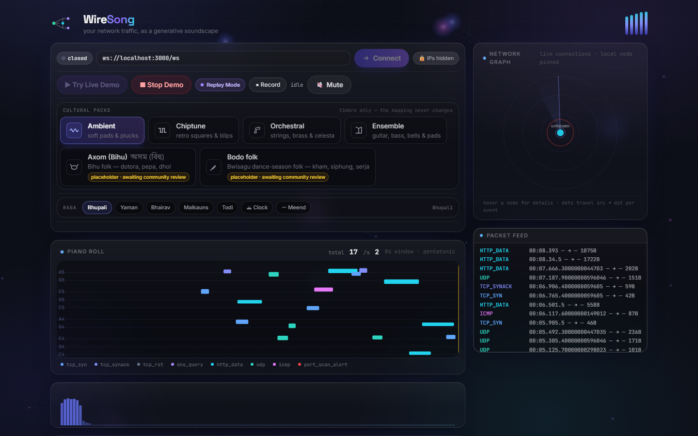
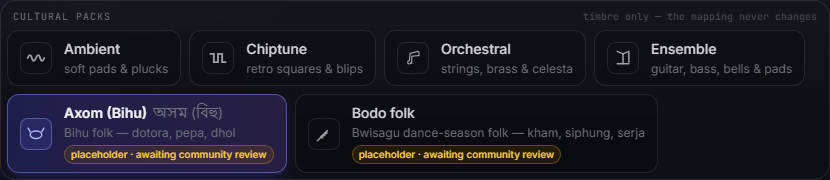
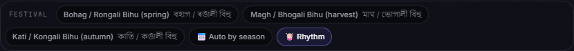

<div align="center">

# WireSong

[](https://github.com/MadB0i/WireSong/actions/workflows/ci.yml)
[](https://MadB0i.github.io/WireSong/)
[](LICENSE)

**Your network traffic, as a generative soundscape.**

[▶ Live demo](https://MadB0i.github.io/WireSong/) · [Quickstart](#quickstart) · [Cultural packs](#cultural-packs) · [Deploy](DEPLOY.md)

</div>



A Rust backend captures packets, quantizes them onto a pentatonic scale so any traffic sounds harmonious, and streams them to a browser that synthesizes each packet as an instrument voice. A port scan cuts through as a distinct four-note alarm with a red flash — sonification as alerting, not just another dashboard.

## Quickstart

**Zero setup — bundled 60-second replay** (no root, no backend):

```bash
cd player && npm install && npm run dev
```

Open the URL, hit **▶ Try Live Demo**. Or try the hosted copy above.

**Live capture** (`capture/` needs libpcap/Npcap + privileges):

```bash
cd capture && cargo run -- --interface <name>
cd player && npm run dev   # Connect → 🔊 Enable Audio
```

**No-privilege traffic** — offline pcap or synthetic stream:

```bash
cd capture && cargo run -- --pcap samples/dns-mdns.pcap
cd capture && cargo run -- --synthetic --rate 20
```

## How it works

```
packets → classify → port-scan detector → mapper (ambient.toml) → WebSocket → Tone.js voices
```

`capture/instruments/ambient.toml` is the single source of truth for pitch/velocity/duration; frontend packs change timbre only. IPs are masked in the UI and stripped from every export. Details: [`docs/DESIGN.md`](docs/DESIGN.md).

## Cultural packs

Six timbres, switchable mid-stream — four stock synths plus folk packs with raga scales, season calendars, and a drum layer:



| Pack | Sound |
|---|---|
| Ambient · Chiptune · Orchestral · Ensemble | stock synth timbres (Ambient is default) |
| **Axom (Bihu)** অসম (বিহু) | dotora, toka, taal, baanhi, gogona, xutuli, pepa + dhol roll, Sa-Pa drone |
| **Bodo folk** | kham, siphung, serja, jotha + Bwisagu calendar (skeleton) |



Folk packs are community-reviewed placeholders (badged in the UI) carrying folk/festival/secular material only — no ritual or devotional content, no shipped recordings yet (self-recorded or CC0 only). Add yours: copy `player/src/packs/bodo/`, map 8 events, open a PR. Full schema: [`docs/CULTURAL_PACKS.md`](docs/CULTURAL_PACKS.md). Assamese/Bodo musician feedback welcome.

## Share & deploy

- **⬆ Share Page** exports a standalone HTML file (audio + piano roll, no IPs) — see it in the demo via ● Record.
- **Backend → Render**: blueprint ready in `render.yaml`, **not yet deployed** — exact steps in [`DEPLOY.md`](DEPLOY.md) (~2 min).

## Project structure

```
capture/   Rust: pcap capture, classify, port-scan detect, map, WebSocket
player/    React 19 + TS + Vite + Tone.js (packs · ragas · rhythm · festivals)
docs/      DESIGN.md · CULTURAL_PACKS.md · screenshots
```

## Contributing

PRs welcome — run `cargo test` (capture/) and `npm test` (player/) first. MIT licensed.
